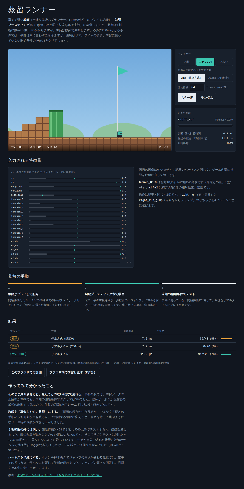

# 蒸留ランナー（ml-distillation-game-agent）

重くて遅い「教師」のプレイを、従来型の機械学習（勾配ブースティング木）に蒸留して、横スクロールアクションをリアルタイムにプレイさせるデモです。

Zennの記事「[Jevにゲームをやらせるな！LLMを蒸留してみよう！](https://zenn.dev/nwn/articles/e49154653ecea9)」の流れを、自作のゲームと自作の教師で再現しました。記事ではLLMが教師でしたが、ここでは全通りを試す先読みプランナーを教師にしています。規約を気にせず蒸留を試せます。



## 動かし方

`index.html` をブラウザで開くだけです。ビルドもサーバーも要りません。

- プレイヤーを「教師」「生徒 GBDT」「あなた」から選べます
- 判断が反映されるまでの遅延を 0ms（ゲーム停止方式）と 260ms（API想定）から選べます
- 「このブラウザで再計測」「ブラウザ内で学習し直す」は Web Worker で動きます

## 結果

学習に使っていない開始タイミングでテストした結果です（`node scripts/bench.js`）。

| プレイヤー | 方式 | 判断1回 | クリア |
|---|---|---|---|
| 教師 | ゲーム停止（遅延0） | 7.2 ms | 35/40（88%） |
| 教師 | リアルタイム（260ms遅延） | 7.2 ms | 0/20（0%） |
| 生徒 GBDT | リアルタイム | 12.6 µs | 91/120（76%） |

生徒は教師より約570倍速く判断します。

## 仕組み

| 部品 | 内容 |
|---|---|
| ゲーム | 自作の横スクロール（地面・穴・土管・段差・歩く敵）。60fpsの決定的シミュレーション |
| ハーネス | ゲーム状態を21次元の数値に変換（速度、接地、前方10タイルの地形、前方の敵2体） |
| 行動 | `right_run`（右へ走る）/ `right_run_jump`（走りながらジャンプ）の2択を4フレームごとに選ぶ |
| 教師 | 256通りの手順を60フレーム先まで試し、「生き残る続き手の割合」が大きい方を選ぶ |
| 生徒 | 勾配ブースティング木をJSで自作（LightGBMと同じヒストグラム＋葉優先成長）。葉31枚×300本 |
| データ | 開始待機 0,3,6…177 の60通りで学習、それ以外の120通りでテスト |

## ファイル

```
index.html          デモ本体（ビルド済み、1ファイル）
src/core.js         ゲーム・特徴量・教師・GBDT（ブラウザとNode.jsの両方で動く）
src/page.html       ページのテンプレート
model/model.json    学習済みモデル
scripts/train.js    教師のデータ収集 → 学習 → DAgger（node scripts/train.js、数十分）
scripts/bench.js    教師と生徒の計測（node scripts/bench.js、数分）
scripts/build.py    core.js とモデルを埋め込んで index.html を作る（python3 scripts/build.py）
```

## 作ってみて分かったこと

- **そのまま真似させると、見たことのない状況で崩れる。** 最初は学習データの正解率が98%でも、テストのクリアは5%でした。教師が「ぶつかる直前の最後の瞬間」に跳ぶので、4フレームずれるだけで詰むためです。
- **教師を真似しやすくする。** 「最善の続きが生き残るか」ではなく「続きの手順のうち何割が生き残るか」で判断させると、余裕を持って跳ぶようになり、生徒の成績が上がりました。
- **ハーネスを単純にする。** 押す長さでジャンプの高さが変わる仕様では、空中での押し方がラベルに混ざって学習が崩れました。高さを固定しています。
- **学習範囲の外には弱い。** 開始待機0〜59で学習して60以降でテストすると、ほぼ全滅しました。
- DAgger（生徒が訪れた状態に教師がラベルを付け足す手法）と判定しきい値の調整は、この設定では効きませんでした。

## ライセンス

[MIT License](LICENSE)
